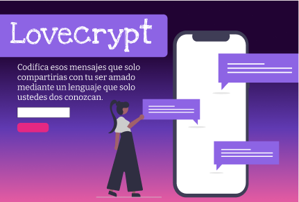
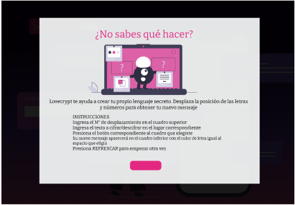

# LOVECRYPT
## 1. Preámbulo
Es díficil mantener 100% en privado nuestra mensajería. El cifrado Cesár es una opción simple pero útil para una posible solución para este problema

## 2. Resumen del proyecto
LOVECRYPT es una web que cifra y descifra la mensajería de parejas 
mediante el cifrado Cesar, para mantener en privado los temas íntimos 
que se puedan intercambiar  en tus mensajes ,más aún si estamos en una relación.

## 3. Definición del producto
¿Por qué elegir este tema?
Como chica enamorada que vive en una familia extensa con un solo ordenador. Por el tema de covid, los integrantes de mi familia (niños, adolescentes) necesitan hacer uso del celular o de la laptop gran parte del dia,asi que yo busco
una manera de seguir teniendo privacidad en mi mensajería, aún si ellos están haciendo uso de estos.

### Usuarios de LOVECRYPT
Personas con pareja entre 15 y 99 años que no cuenten con total privacidad en 
su mensajeria, que por "x" motivos existan allegados a la pareja 
que puedan echar un ojo a su conversación.

### Objetivos de usuario en relación a LOVECRYPT
El usuario de LOVECRYPT debe ser capaz de poder cifrar y/o 
descifrar la mensajería que intercambia con su pareja de una
manera(elección de desplazamientos) que solo los dos puedan reconocer

### Solución que brinda LOVECRYPT al problema del Usuario
Si bien el cifrado cesar no es el mejor metodo para cifrar mensajes,
es una opcion para aumentarle un grado de seguridad a estos.
LOVECRYPT encripta y desencripta los mensajes que puedan surgir entre parejas, como temas intimos o secretos sin que 
el usuario se complique en buscar cómo crear una nueva forma de comunicion segura y confidencial

## 4. Criterios considerados

Uso del alfabeto sin Ñ (Mayusculas, minusculas):
* A B C D E F G H I J K L M N  O P Q R S T U V W X Y Z

Reconocer vocales(Mayúsculas y minúsculas) con tildes y encriptarlos:
* Á É Í Ó Ú

Reconocer números y encriptarlos:
* 0 1 2 3 4 5 6 7 8 9

Reconocer demás caracteres y dejarlos igual

### Interfaz de usuario (UI)

La interfaz debe permitir al usuario:
* Ingresar edad para restriccion de encriptacion de mensajes a menores
* Elegir un desplazamiento (offset) indicando cuántas posiciones queremos que
  el cifrado desplace cada caracter.
* Insertar un mensaje (texto) que queremos cifrar.
* Ver el resultado del mensaje cifrado.
* Insertar un mensaje (texto) a descifrar.
* Ver el resultado del mensaje descifrado.
* Refresacar los espacios para volver a rellenarlos por el mismo usuario

## 5. Prototipo
Uso de Figma:
[Link](https://www.figma.com/file/Eo78nv61giIRbMfPthyQqo/LOVECRYPT-Cipher?node-id=0%3A1)

## 6. Objetivos de aprendizaje
### HTML
- [x] Uso de HTML semántico

### CSS
- [x] Uso de selectores de CSS
- [x] Modelo de caja (box model)

### Web APIs
- [x] Uso de selectores del DOM
- [x] Manejo de eventos del DOM
- [ ] Manipulación dinámica del DOM

### JavaScript
- [x] Tipos de datos primitivos
- [x] Strings
- [x] Variables
- [x] Uso de condicionales
- [x] Uso de bucles/ciclos
- [x] Funciones
- [x] Pruebas unitarias
- [ ] Módulos de ECMAScript
- [ ] Uso de linter (ESLINT)
- [ ] Uso de identificadores descriptivos

### Control de Versiones (Git y GitHub)
- [x] Git: Instalación y configuración
- [ ] Git: Control de versiones con git
- [ ] GitHub: Creación de cuenta y repos
- [ ] GitHub: Despliegue con GitHub Pages

### UX (User eXperience)
- [x] Diseñar la aplicación pensando en y entendiendo al usuario
- [x] Crear prototipos para obtener feedback e iterar
- [ ] Aplicar los principios de diseño visual (contraste, alineación, jerarquía)
